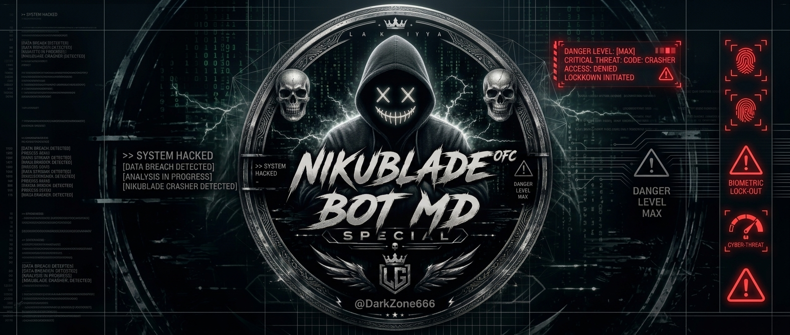

# NIKU MD BOT v3.0

Bot de automatización para WhatsApp basado en **Baileys**, con herramientas de grupos, descargas, economía, perfiles, stickers, IA y panel web.

**Desarrollado por:** ɴɪᴋᴜ_ʙʟᴀᴅᴇꫂꤪꤨᴼᶠᶜ『𝙻𝚃𝙼』<br>
**Telegram:** [@Niku_Blade](https://t.me/Niku_Blade)

<p align="center">
  
</p>

<p align="center">
  <a href="https://whatsapp.com/channel/0029Vb5s0hbADTO8E0xtQI1l"></a>
  <a href="https://t.me/Dark_Zone_666"></a>
  <a href="https://github.com/cruzridel6-lab/web-niku-md-eye"></a>
</p>

## ¿Qué hacemos?

Compartimos actualizaciones, código, **VIM, Methods, Bots**, recursos de automatización y proyectos educativos relacionados con WhatsApp, Node.js y desarrollo web.

## Funciones principales

- **Administración de grupos:** abrir/cerrar, enlaces, kick, promote, demote, tagall, mute, antilink y modo Solo Admin.
- **Horarios de grupos:** los administradores pueden usar `.horario abrir 08:00` y `.horario cerrar 22:00`; la configuración queda guardada y se ejecuta cada día incluso después de reiniciar.
- **Economía y perfiles:** saldo, trabajo, diario, pagos, apuestas, matrimonio, biografía y configuración de perfil.
- **Stickers:** imágenes, videos y stickers con texto: `.sticker Hola NIKU MD`.
- **Descargas y herramientas:** YouTube, TikTok, Instagram, APK, búsqueda, traducción, portscan y utilidades.
- **Anime y diversión:** reacciones, juegos y comandos interactivos.
- **Panel web:** dashboard oscuro, estadísticas en tiempo real, comentarios y consola ADMIN privada.
- **Reportes:** cualquier usuario puede usar `.reporte Descripción del problema`; el bot envía el nombre, número, hora y descripción al canal de WhatsApp configurado.
- **Moderación administrativa:** desde el panel se puede banear un número, impedir que vuelva a vincularse y desvincular su sesión activa.
- **Antiporno local:** `.antiporno on/off` elimina enlaces y texto sexual, analiza imágenes, stickers y el primer fotograma de videos con NSFWJS/TensorFlow.js dentro del servidor, y expulsa al remitente sin enviar archivos a una IA externa.
- **SuperToken:** el panel muestra los comandos Premium incluidos y permite generar un SuperToken temporal para habilitarlos mediante `.reclamar <supertoken>`.
- **Moderación:** la ruta `/moderacion` tiene login independiente, permisos limitados por casillas y herramientas para SuperTokens, bloqueos, usuarios y sesiones.
- **Premium:** se eliminó la compra mediante `.tienda`; el acceso Premium solo se concede mediante SuperToken o desde Administración.
- **Economía RPG:** `rpgmenu`, `economymenu` y `economiarpg` abren el mismo sistema RPG. Perfiles, vínculos, niveles, clanes, misiones, herramientas, combates y economía comparten esta categoría y sus respuestas usan narrativa de aventurero.
- **Clases y progresión:** cada perfil muestra nivel y XP; el jugador puede elegir una sola clase con `.clase guerrero`, `.clase mago`, `.clase picaro`, `.clase tirador` o `.clase paladin` (también acepta `.clase paladín`). Paladín obtiene +15% en mazmorras y cuenta con habilidades de curación y defensa sagrada.
- **Selección posterior al registro:** después de `.registrarse`, el bot muestra las descripciones y ventajas de Guerrero, Mago, Pícaro, Tirador y Paladín. El panel de usuarios RPG actualiza en vivo el nombre, la clase, el nivel y la experiencia.
- **Equipamiento, fabricación y botín:** cada clase dispone de cuatro piezas de equipo; las dos nuevas pueden aparecer como drops únicos en las mazmorras. Fabrica `.fabricar espada_abismal`, `.fabricar armadura_escamas` o `.fabricar amuleto_lunar`; gestiona armas, armaduras y accesorios con `.inventario equipar <id>` y `.inventario quitar <id>`. Las piezas activas mejoran combate o recompensas según su tipo.
- **Subasta RPG:** `.subastar <id> <precio> [minutos]` admite drops de mazmorra en cualquier rareza, botines de minería/pesca/caza, equipo de clase, equipo fabricado, materiales, pociones y herramientas con su durabilidad. Ejemplos: `.subastar gema_lunar:legendario 9000`, `.subastar sword_iron 1500` y `.subastar espada 1500`. El equipo de clase solo se puede comprar con esa misma clase; las cancelaciones y cierres sin pujas devuelven el objeto.
- **Raids cooperativas:** en un grupo, un jugador puede consultar los jefes con `.raid jefes`, crear una raid con `.raid crear`, unirse con `.raid unirse` y atacar con `.raid atacar`. Hay tres jefes épicos, máximo 8 participantes, 10 minutos de duración, daño con bonificaciones de clase/equipo y recompensas compartidas de monedas y XP. Usa `.raid estado` para consultar la vida del jefe.
- **Logros y títulos:** además de los logros de raid, ahora hay hitos de exploración, botín raro/legendario, equipo encontrado en mazmorras y compras de arsenal. Se consultan con `.logros`; los títulos, con `.titulos`.
- **Rankings públicos compactos:** la web muestra logros, Niku Coins, PvP e historial en una sola tarjeta con pestañas y scroll interno, evitando que la página se alargue innecesariamente.
- **Moneda del reino:** la moneda visible del bot y la web se llama **Niku Coins**. El ranking se consulta con `.nikutop`; `.nekotop` continúa disponible como alias anterior.

## Instalación rápida

> Requiere **Node.js 18+**, FFmpeg y Python disponible como `python` para `youtube-dl-exec`.

```bash
git clone https://github.com/cruzridel6-lab/web-niku-md-eye.git
cd web-niku-md-eye
npm install
cp .env.example .env
npm start
```

Después, abre el panel web indicado en la consola y vincula tu número mediante el código de emparejamiento.

## Configuración mínima

Edita `.env` antes de iniciar:

```env
OWNER_NUMBER=tu_numero_con_codigo_de_pais
OWNER_TELEGRAM_ID=tu_id_de_telegram
TELEGRAM_BOT_TOKEN=token_opcional
OPENAI_API_KEY=clave_opcional
PORT=3000
# Reportes: opcionalmente fija el JID interno del canal y la zona horaria mostrada
REPORT_CHANNEL_JID=120363xxxxxxxxxx@newsletter
REPORT_TIMEZONE=America/New_York
# Zona predeterminada de los horarios diarios de grupos
GROUP_SCHEDULE_TIMEZONE=America/New_York
# En Railway: ruta donde estará montado el volumen persistente
PERSISTENT_DATA_DIR=/data/bot
GITHUB_BACKUP_TOKEN=token_privado_con_contents_write
GITHUB_BACKUP_REPO=cruzridel6-lab/web-niku-md-eye
GITHUB_BACKUP_BRANCH=main
GITHUB_BACKUP_PATH=data/persistent-state.enc
BACKUP_ENCRYPTION_KEY=clave_larga_y_unica
```

Para Railway, configura las mismas variables en **Variables** e incluye Python y FFmpeg en el entorno de despliegue.

### Persistencia en Railway

Railway usa un sistema de archivos temporal si no se configura un volumen. Para conservar sesiones, economía, perfiles, tokens Premium y configuraciones:

1. En el servicio de Railway, crea un **Volume**.
2. Monta el volumen en `/data`.
3. Añade la variable `PERSISTENT_DATA_DIR=/data/bot`.
4. Usa una sola réplica del servicio para que la sesión de WhatsApp y el volumen no se dividan entre instancias.
5. Despliega nuevamente y verifica que `data/auth_info/` y `data/bot_data.json` estén dentro del volumen local (o `/data/bot/auth_info/` y `/data/bot/bot_data.json` cuando uses la variable).

El bot centraliza en `data/` la economía, perfiles, duelos PvP, RPG, Premium, tokens, configuraciones, reportes del panel y archivos persistentes de `uploads/`. Escribe `bot_data.json` de forma atómica y conserva una copia `bot_data.json.bak` para recuperarse si un proceso se interrumpe durante una escritura. La carpeta `auth_info/` también se guarda dentro de la ruta persistente, por lo que no debería ser necesario volver a vincular el número después de cada deploy. Si existe una instalación anterior en `bot/`, el primer arranque la migra automáticamente a `data/`.

En un hosting con sistema de archivos temporal, crear `data/` dentro del repositorio por sí solo no garantiza la conservación después de un deploy: debes usar un volumen persistente o activar el respaldo cifrado de GitHub descrito abajo.

### Protección contra abuso económico

El bot aplica límites diarios moderados para proteger la economía sin impedir el progreso normal:

- hasta `50.000` Niku Coins transferidos por jugador;
- hasta `10` transferencias diarias;
- hasta `8` transferencias al mismo destinatario;
- hasta `20.000` Niku Coins apostados en duelos PvP;
- hasta `10.000` Niku Coins apostados en coinflip/ruleta.

Los intentos bloqueados se guardan en `economyAbuseAlerts` dentro de `bot_data.json`, junto con el contador `economyStats.abuseBlocked`, para que administración pueda revisarlos sin exponerlos al chat público.

Para automatizar un grupo, usa en ese grupo (siendo administrador):

```text
.horario abrir 08:00
.horario cerrar 22:00
.horario zona America/New_York
.horario ver
.horario off
```

Las horas usan formato de 24 horas. El horario es diario, se guarda dentro de `bot_data.json` y se restaura junto con el respaldo de GitHub. Cada grupo puede tener su propia zona horaria; si no se indica, se usa `GROUP_SCHEDULE_TIMEZONE` o `America/New_York`.

Si configuras las variables de GitHub anteriores, el bot restaura al arrancar y actualiza cada 30 segundos `data/persistent-state.enc` mediante la API de GitHub. El respaldo está cifrado con AES-256-GCM e incluye perfiles registrados, monedas y economía, logros, Premium y tokens, configuraciones, reportes, vinculaciones/sesiones de WhatsApp y archivos persistentes de `uploads/`. GitHub solo recibe el texto cifrado; no se guardan esos datos en texto plano dentro del repositorio. El token de GitHub y la clave de cifrado deben existir únicamente en Railway Variables.

> Importante: `data/` es la carpeta reservada para el respaldo. Nunca subas `bot_data.json`, `auth_info/`, `uploads/` ni la clave de cifrado en texto plano. El archivo seguro es `data/persistent-state.enc`, generado por el bot mediante la API de GitHub.

## Actualizaciones recientes

- Menú principal y submenús reorganizados en español.
- Nueva categoría ADMIN con comandos adaptados de Raiden-WaBot.
- Bienvenida, despedida, alertas y textos personalizados para grupos.
- `mute` y `unmute` para grupos y usuarios, con lista de silenciados.
- `.ai` con respuesta de disponibilidad del proveedor.
- Stickers con texto en formato WebP.
- Mejoras de persistencia, manejo de errores y estabilidad del panel web.

## Canales y comunidad

- [Canal de WhatsApp](https://whatsapp.com/channel/0029Vb5s0hbADTO8E0xtQI1l)
- [Canal de Telegram](https://t.me/Dark_Zone_666)
- [Repositorio oficial](https://github.com/cruzridel6-lab/web-niku-md-eye)

## Uso responsable

Usa el bot respetando las reglas de WhatsApp, la privacidad de las personas y las leyes aplicables. Las herramientas se ofrecen para aprendizaje, automatización y desarrollo responsable.

## Licencia

MIT
